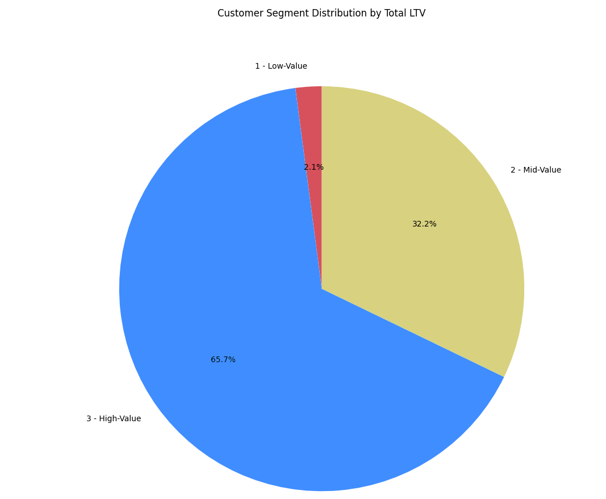
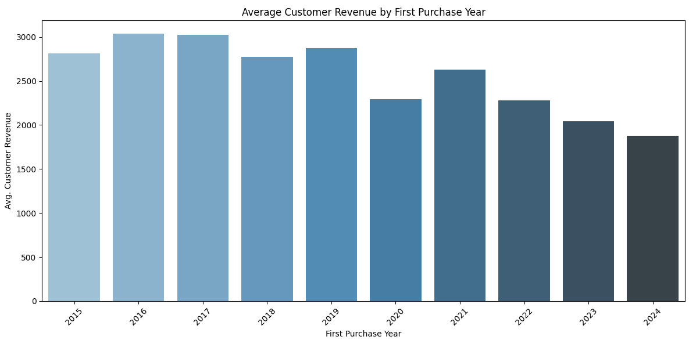
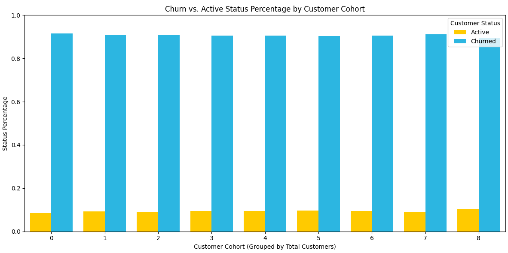

# Geoffrey Barnes' Intermediate SQL - Sales Analysis Project

## Overview
This is an analysis of customer behavior pertaining to the contoso_100k database. I analyze how different customers with different traits spend their money year to year. I go over retention, cohort analysis and customer segmentation analysis to gain insights from the data and provide business recommendations to the company.

## Business Questions

1. **Customer Segmentation Analysis:** How do different customers in the bottom 25%, middle 50% and top 25% compare when it comes to spending?
2. **Cohort Analysis:** How does revenue generation change when looking at different customers?
3. **Retention Analysis:** What percentage of customers have purchased from us within six months of their first purchase? What is the churn rate?

### 1. Customer Segmentation Analysis
I first summed up each customer's total value inside the data from Contoso_100k. Then I segmented them into the top 25%, bottom 25% and middle 50% and called these High, Low, and Mid value. I added a 1, 2 and 3 to the front of the names as to get a better ordering while working with these numbers.

Then I selected the total long term value (LTV) of each grouping to see how different these were. From the data I found that 135.6 million dollars came in from the high value customers, 66.4 million from the mid value and 4.3 million from the low.

Next I took the average of each of the different tiers of value, finding that the high value customers made the company almost 11 thousand dollars on average, while the low value made only 347 dollars on average. Quite a big difference.

**Query:**
[1_customer_segmentation_analysis](/1_customer_segmentation_analysis.sql)

Graphing the results:

**Visualization**

**Findings**
I found that 65.7% of revenue comes from the top 25% of customers, this is not surprising, but the bottom 25% make up a significantly smaller percentage, that being 2.1%. Mid level customers make up 32.2% of profits. 

**Key Business Insights**
I found that a significant portion of the revenue from this company data comes from the top 25%, specifically 65.7% of it. This means High value customers are worth targeting with ads, as the company is seeing success with them. Another insight is that the bottom 25% make up only 2.1% of profits, which means these people are willing to be customers, but are not spending as much as the higher value customers. The company should work on moving those low value customers into the mid, or even high value ranges.
### 2. Cohort Analysis
- Tracked customer count per cohorts and revenue
- Cohorts were grouped by year of first purchase
- Analyzed customer retention at a cohort level

**Query:** [2_cohort_analysis](/2_cohort_analysis.sql)

**Visualization**

**Findings**
- Revenue per customer declines, while the total count of customers increases. The number of customers per year dips significantly during the pandemic, starting in 2020, but there is still a trend of an increase in the number of customers.

**Key Business Insights**
- It is clear that the average customer is spending less and less money with each passing year. The trend is definitely going down. Although, from other data we know that the company is getting more customers, so the revenue in total is not taking quite the nose dive. This means we should do what has been done before to get customers to spend more, as the company has proven it has done previously.

### 3. Retention Analysis

**Query:** [3_retention_analysis](/3_retention_analysis.sql)

**Visualization**

**Findings**
- Retention rates are consistently lower than the average for our field. The trend is going upwards, starting at around 8% and moving up to around 10%, which is still below the industry average of about 22%.

- Over the COVID pandemic we see no large dip or increase in retention, as our churn rate is still similar to years prior.

**Key Business Insights**
- It would be reasonable to strengthen our retention by giving an incentive to get customers to keep buying from the company, such as a membership program with discounts. Since our retention is below the industry average, if this trend continues we will stay at a lower retention and will likely see less of the second and third time purchases that our competitors will. This could lead to us getting out competed.

## Strategic Recommendations
- We should start a membership program as stated above, so people remember who they've bought from in the past and can continue to rely on us for their needs. 

- We could also advertise more to people who have bought from us previously as to boost retention.

- Another strategy is to see what consumers think if our products months after purchasing, this means surveys to see why people are choosing not to buy from us after their first purchase. Is it because they were unsatisfied with the product longer term? Were they unsatisfied right after purchasing from us? We could also do surveys right after the first purchase to address the problems right after purchasing, if there are some.

## Technical Details

I had minimal difficulties with this project. I created visuals using Python with the help from a few languages and some AI to speed up the process. I also found using SQL with DBeaver was very easy and intuitive. There were very few technical difficulties during this process if any.

I used DBeaver, Visual Studios, PostgreSQL, ChatGPT (for graphing), SQL and Python, and I also followed along and added to 'Luke Barousse SQL for Data Analytics - Intermediate Course + Project'.